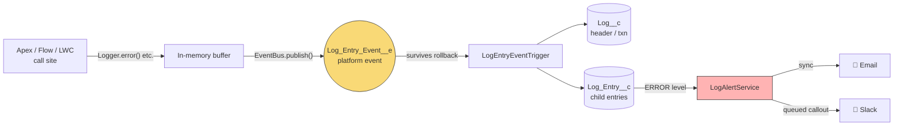

<div align="center">

# ⚡ JayOh Logger

**Org-local error logging for Salesforce, built to survive the transaction that broke.**

[](https://developer.salesforce.com/)
[](sfdx-project.json)
[](#)
[](#-tests)
[](#-changelog)

*Inspired by [Nebula Logger](https://github.com/jongpie/NebulaLogger)'s core idea — reimplemented lean, and platform-event-backed from the ground up.*

</div>

---

## 🧠 The core idea

If a transaction throws and rolls back, any `Log_Entry__c` you inserted earlier in that *same* transaction rolls back with it — you lose the exact error you built this to capture.

**JayOh Logger publishes every log entry as a platform event first.** Platform events commit independently of the surrounding transaction, so the entry survives even when everything else unwinds. A separate trigger then persists it into durable objects.



---

## ✨ Features

| | |
|---|---|
| 🪵 **Rollback-safe logging** | Platform-event-backed persistence — `ERROR` entries survive a failed transaction |
| 🎚️ **Configurable levels** | Per Permission Set / Profile / org default, via Custom Metadata — no deploy to change |
| 🕵️ **Auto-masking** | Card numbers, SSNs, API keys scrubbed before persist; patterns are editable Custom Metadata |
| 🧭 **Quiddity capture** | Every entry auto-records execution context (`BATCH_APEX`, `QUEUEABLE`, `AURA`, etc.) |
| 🔔 **Alerting** | Email + Slack on `ERROR`, toggled per org |
| 🧹 **Retention + export** | Scheduled purge batch, with an optional CSV email before anything's deleted |
| 🖥️ **LWC log viewer** | Drop-in component to browse recent logs without leaving the app |
| 🌐 **Client-side capture** | Global JS error boundary for LWC — uncaught errors stop vanishing into the console |
| 📊 **Reports** | Custom report type + two starter reports (`Recent Errors`, `Errors by Source`) |
| 📦 **Flow & LWC entry points** | `@InvocableMethod` and `@AuraEnabled` — not Apex-only |

---

## 🗂️ What's in the package

```
force-app/main/default/
├── classes/            Logger, LoggerInvocable, LogEntryEventHandler,
│                       LogAlertService, LogMasking, LogPurgeBatch,
│                       LogViewerController, LogLevelSettingSelector …
├── triggers/           LogEntryEventTrigger  (platform event → durable objects)
├── objects/            Log__c · Log_Entry__c · Log_Entry_Event__e
│                       Log_Level_Setting__mdt · Log_Alert_Setting__mdt
│                       Log_Masking_Pattern__mdt
├── customMetadata/     Seeded defaults for the three CMDTs above
├── lwc/                logViewer (visible)  ·  loggerClient (headless utility)
├── reportTypes/        Log_And_Log_Entries
└── reports/            Recent Errors · Errors by Source
```

---

## 🚀 Quick start

**Deploy to any org:**
```bash
sf project deploy start --source-dir force-app -o <target-org-alias>
```

**Log from Apex:**
```apex
try {
    // risky callout
} catch (Exception ex) {
    Logger.error('CBHttpClient.patchShippingAddress', 'Chargebee PATCH failed', ex);
}
Logger.flush(); // ERROR auto-flushes; call explicitly for INFO/DEBUG/WARN buffers
```

**Log from Flow:** use the *"Log Message"* invocable action.

**Log from LWC:**
```js
import { logError, installGlobalErrorBoundary } from 'c/loggerClient';

// one-off
logError('myComponent.handleSave', error);

// once, from your top-level component — catches uncaught errors app-wide
installGlobalErrorBoundary('myAppShell');
```

**Schedule the purge job (once per org):**
```apex
System.schedule('JayOh Log Purge - Weekly', '0 0 2 ? * SUN', new LogPurgeBatch());
```

---

## ⚙️ Configuration (all Custom Metadata — no deploy required)

| Custom Metadata Type | Controls |
|---|---|
| `Log_Level_Setting__mdt` | Minimum log level per Permission Set/Profile/org; retention days; export-before-purge |
| `Log_Alert_Setting__mdt` | Email/Slack toggles, recipients, webhook URL |
| `Log_Masking_Pattern__mdt` | Active regex patterns scrubbed from every message before persist |

---

## 🧪 Tests

10 classes, full coverage of the Apex surface:

`LogLevelTest` · `LogMaskingTest` · `LogLevelSettingSelectorTest` · `LogEntryEventHandlerTest` · `LoggerTest` · `LoggerInvocableTest` · `LogPurgeBatchTest` · `LogAlertServiceTest` · `LogAlertQueueableTest` · `LogViewerControllerTest`

> Platform-event delivery in tests uses `Test.getEventBus().deliver()` after `Test.stopTest()` — that's what fires `LogEntryEventTrigger` synchronously so persisted rows can actually be asserted on.

```bash
sf apex run test --test-level RunLocalTests --result-format human --wait 10 -o <target-org-alias>
```

---

## 📦 Packaging for multi-org use

See **[`PACKAGING.md`](PACKAGING.md)** for the full `sf package create` → `version create` → `install` walkthrough. Turning this into a versioned unlocked package means every client org installs from the same source instead of diverging hand-deployed copies.

---

## 🗺️ Changelog

<details>
<summary><strong>v0.3</strong> — Reports & packaging groundwork</summary>

- Custom report type `Log_And_Log_Entries` joining `Log__c` → `Log_Entry__c`
- Starter reports: `Recent Errors` (last 7 days), `Errors by Source` (last 30 days, grouped)
- `PACKAGING.md` with exact unlocked-package CLI commands
- *Not built as code:* dashboard — build in-org, since it needs a folder ID that only exists post-deploy

</details>

<details>
<summary><strong>v0.2</strong> — Alerting, masking, visibility</summary>

- **Alerting:** email (sync) + Slack (queued callout) on `ERROR`
- **Configurable masking:** patterns moved to Custom Metadata, seeded with card/SSN/API-key defaults
- **Quiddity capture:** execution context recorded automatically on every entry
- **Retention export:** CSV emailed before purge, gated by Custom Metadata
- **LWC log viewer:** browse/filter/drill into recent logs
- **Client-side capture:** headless `loggerClient` utility + global JS error boundary

</details>

<details>
<summary><strong>v0.1</strong> — Core framework</summary>

- `Log__c` / `Log_Entry__c` / `Log_Entry_Event__e` platform-event pipeline
- `Logger.cls` + `LoggerInvocable` (Flow/LWC entry points)
- Per-Permission-Set/Profile log level control
- Regex-based masking, scheduled retention purge

</details>

---

## 🔭 Still open

- Bulk behavior above 200 events in a single publish batch, beyond what's tested
- No test proving `LogAlertQueueable` behavior on a non-200 Slack response (currently swallowed/logged to debug)
- Global JS error boundary is opt-in per app shell, not auto-wired into every LWC in a client org

---

<div align="center">

Built for <a href="https://jayoh.io">JayOh Consultants</a> · maintained across client engagements, not a single org

</div>
