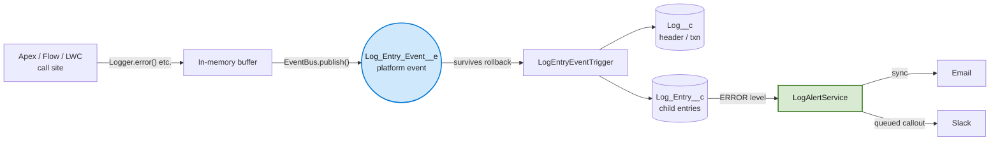

<div align="center">

# JayOh Logger

**Org-local error logging for Salesforce, built to survive the transaction that broke.**

[](https://developer.salesforce.com/)
[](sfdx-project.json)
[](#)
[](#tests)
[](#changelog)

*A native, platform-event-backed logging framework — built for reuse across every client org.*

</div>

---

## The core idea

If a transaction throws and rolls back, any `Log_Entry__c` you inserted earlier in that *same* transaction rolls back with it — you lose the exact error you built this to capture.

**JayOh Logger publishes every log entry as a platform event first.** Platform events commit independently of the surrounding transaction, so the entry survives even when everything else unwinds. A separate trigger then persists it into durable objects.



---

## Features

| | |
|---|---|
| **Rollback-safe logging** | Platform-event-backed persistence — `ERROR` entries survive a failed transaction |
| **Four save methods** | `EVENT_BUS` (default), `QUEUEABLE`, `REST`, `SYNCHRONOUS_DML` — pick the right limit/rollback trade-off per call |
| **Fluent builder API** | Chain `.setRecord()`, `.addTag()`, `.setExceptionDetails()` off any log call |
| **Tagging** | Normalized `Log_Tag__c`/`Log_Entry_Tag__c` — dedupe automatically, queryable and reportable |
| **Parent/child transaction correlation** | Thread a batch/queueable job's separate transactions back to the log that kicked it off |
| **Lazy-formatted messages** | `LogMessage` skips `String.format()` entirely when the entry's level is filtered out |
| **Configurable levels** | Per Permission Set / Profile / org default, via Custom Metadata — no deploy to change |
| **Auto-masking** | Card numbers, SSNs, API keys scrubbed before persist; patterns are editable Custom Metadata |
| **Quiddity capture** | Every entry auto-records execution context (`BATCH_APEX`, `QUEUEABLE`, `AURA`, etc.) |
| **Alerting** | Email + Slack on `ERROR`, toggled per org |
| **Retention + export** | Scheduled purge batch, with an optional CSV email before anything's deleted |
| **LWC log viewer** | Drop-in component to browse recent logs without leaving the app |
| **Related Log Entries** | Record-page component showing every log entry tied to that specific record |
| **Log triage** | `Status__c`/`Priority__c` on `Log__c` + a "Manage Log" quick action to edit them inline |
| **Client-side capture** | Global JS error boundary for LWC — uncaught errors stop vanishing into the console |
| **Reports** | Custom report type + two starter reports (`Recent Errors`, `Errors by Source`) |
| **Flow & LWC entry points** | `@InvocableMethod` and `@AuraEnabled` — not Apex-only |

---

## What's in the package

```
force-app/main/default/
├── classes/            Logger, LogEntryBuilder, LogMessage, LoggerInvocable,
│                       LogEntryEventHandler, LogSaveQueueable, LogRestSaver,
│                       LogAlertService, LogMasking, LogPurgeBatch,
│                       LogViewerController, LogLevelSettingSelector …
├── triggers/           LogEntryEventTrigger  (platform event → durable objects)
├── objects/            Log__c · Log_Entry__c · Log_Entry_Event__e
│                       Log_Tag__c · Log_Entry_Tag__c
│                       Log_Level_Setting__mdt · Log_Alert_Setting__mdt
│                       Log_Masking_Pattern__mdt
├── customMetadata/     Seeded defaults for the three CMDTs above
├── lwc/                logViewer, relatedLogEntries (visible)  ·  loggerClient (headless utility)
├── flows/              Log_Fault_Handler (reusable Subflow for Fault Connectors)
├── quickActions/       Manage Log (edit Status/Priority/Owner on Log__c)
├── reportTypes/        Log_And_Log_Entries
└── reports/            Recent Errors · Errors by Source
```

---

## Quick start

**Deploy to any org:**
```bash
sf project deploy start --source-dir force-app -o <target-org-alias>
```

**Log from Apex:**
```apex
try {
    // risky callout
} catch (Exception ex) {
    Logger.error('CBHttpClient.patchShippingAddress', 'Chargebee PATCH failed', ex)
        .setRecord(quote.Id)
        .addTag('chargebee')
        .addTag('shipping-address');
} finally {
    Logger.saveLog(); // see "Governor limits" below for why this must be exactly one call, not one per error
}
```

**Correlate a batch/queueable job's transactions:**
```apex
public class MyBatchJob implements Database.Batchable<SObject> {
    private String originalTransactionId;

    public Database.QueryLocator start(Database.BatchableContext bc) {
        this.originalTransactionId = Logger.getTransactionId();
        Logger.info('MyBatchJob.start', 'Starting job');
        Logger.saveLog();
        return Database.getQueryLocator([SELECT Id FROM Account]);
    }

    public void execute(Database.BatchableContext bc, List<Account> scope) {
        Logger.setParentLogTransactionId(this.originalTransactionId); // links this execute()'s own transaction back to start()'s
        Logger.info('MyBatchJob.execute', 'Processed a scope');
        Logger.saveLog();
    }

    public void finish(Database.BatchableContext bc) {}
}
```

**Log from Flow:** use the *"Log Message"* invocable action (see [Logging from Flow](#logging-from-flow) below).

**Log from LWC:**
```js
import { logError, installGlobalErrorBoundary } from 'c/loggerClient';

// one-off
logError('myComponent.handleSave', error);

// once, from your top-level component — catches uncaught errors app-wide
installGlobalErrorBoundary('myAppShell');
```

**Schedule the purge job (once per org):**
```apex
System.schedule('JayOh Log Purge - Weekly', '0 0 2 ? * SUN', new LogPurgeBatch());
```

---

## Logging from Flow

`LoggerInvocable.logFromFlow` is exposed as an invocable action labeled **"Log Message"**, available in Screen Flows, Autolaunched Flows, and Record-Triggered Flows. It takes:

| Input | Required | Notes |
|---|---|---|
| `level` | Yes | `ERROR`, `WARN`, `INFO`, or `DEBUG` |
| `source` | Yes | Free text — use the Flow's name, e.g. `Flow: Renewal_Closed_Won` |
| `message` | Yes | The text to log |
| `relatedRecordId` | No | Any record Id to link the entry to |

**Ad hoc logging inside a Flow:**

Drop the action anywhere you want a checkpoint logged — after a Get Records, before a risky Update, etc.

**Catching Flow faults (the higher-value use case):**

Flow doesn't log unhandled errors anywhere durable by default — a fault just shows the user a generic error and the transaction is gone. Wire "Log Message" into the **Fault Connector** of any element that can fail (Create/Update/Delete Records, Apex Actions, Sub-flows):

- `level`: `ERROR`
- `source`: the Flow's name (hardcode it — `$Flow.CurrentFlow` variables aren't reliably available in every context)
- `message`: `{!$Flow.FaultMessage}`

Because this goes through the same platform-event pipeline as everything else, a Flow fault logged this way survives even though the Flow's own DML rolled back — same guarantee Apex gets.

**Recommended pattern:** a ready-made reusable Subflow ships with this package — `flows/Log_Fault_Handler.flow-meta.xml`. Connect any element's Fault Connector to it and pass:

- `FaultSource`: the calling Flow's name, hardcoded (e.g. `Renewal_Closed_Won`)
- `FaultMessage`: `{!$Flow.FaultMessage}`
- `RelatedRecordId`: optional, any record Id relevant to the fault

One place to maintain across every BMG/Level Data Flow instead of repeating the action config in each one.

---

## Governor limits (why saveLog()/flush() work the way they do)

`EventBus.publish()` is capped at **150 calls per transaction** — a hard Apex governor limit. Critically, a single `EventBus.publish(list)` call counts as **one** call no matter how many events are in the list, the same way `Database.insert(list)` counts as one DML statement regardless of list size.

**`Logger` buffers every entry in memory and only saves on `saveLog()`/`flush()`.** An earlier version of this class auto-flushed on every `ERROR` call individually; that meant a loop catching 200 errors made 200 separate `publish()` calls and risked the 150-per-transaction ceiling. Buffering avoids that entirely.

The trade-off: **you must call `saveLog()`/`flush()` yourself** — ideally in a `finally` block, so it still runs even when an exception propagates past your `catch`. A buffered entry that never reaches it is silently lost.

**Four save methods** (`Logger.saveLog(Logger.SaveMethod method)`), each trading rollback-safety for a different limit profile:

| Method | Behavior | Trade-off |
|---|---|---|
| `EVENT_BUS` (default) | Publishes as a platform event | Survives a transaction rollback; counts against the 150-calls-per-transaction and org-wide daily/hourly publish limits |
| `QUEUEABLE` | Defers the insert to a separate async job | That job gets its own independent governor limits — but log entries no longer survive a rollback the same way, since they're queued as a job, not published as an event |
| `REST` | Synchronous callout to this org's own REST API using the current session | Avoids a local DML statement entirely — useful when DML isn't safe/available in the current context. **Experimental** — see `LogRestSaver`'s class comment; needs a Remote Site Setting added post-deploy and hasn't been verified against a live org from this environment |
| `SYNCHRONOUS_DML` | Bypasses platform events, inserts directly | Fastest and simplest, but **loses rollback-safety entirely** — if the surrounding transaction rolls back, so do your log entries. Use for local debugging or when platform event allocations are exhausted |

Other controls:

| Method | Behavior |
|---|---|
| `Logger.flushBuffer()` | Discard everything buffered, without saving |
| `Logger.suspendSaving()` / `resumeSaving()` | Ignore log calls entirely until resumed — useful for silencing a known-noisy code path without removing call sites |
| `Logger.setSaveMethod(method)` | Changes the default `saveLog()`/`flush()` uses for the rest of the transaction |
| `Logger.setParentLogTransactionId(String)` | Threads a batch/queueable job's separate transactions back to the log that kicked it off |

There's also a separate, **org-wide** daily/hourly limit on platform events published (varies by edition — see [Salesforce's Platform Event Limits](https://developer.salesforce.com/docs/atlas.en-us.platform_events.meta/platform_events/platform_event_limits.htm)). Batching solves the per-transaction risk; it doesn't remove this ceiling — worth monitoring in a very high-volume org.

---

## Fluent builder, tags, and lazy-formatted messages

Every `Logger.error()/warn()/info()/debug()` call returns a `LogEntryBuilder` so you can chain additional detail onto the same entry without extra Logger calls:

```apex
Logger.error('CBHttpClient.patch', 'Callout failed', ex)
    .setRecord(quote.Id)      // links Log_Entry__c.RelatedRecordId__c
    .addTag('chargebee')
    .addTag('shipping-address');
```

Tags are stored raw on the entry (`Tags__c`) and normalized on persist into `Log_Tag__c` (deduped by name) and `Log_Entry_Tag__c` (junction) — so `SELECT ... FROM Log_Entry_Tag__c WHERE Log_Tag__r.Name = 'chargebee'` finds every entry ever tagged that way, across every transaction.

For messages expensive to build, `LogMessage` defers `String.format()` until `Logger` has already decided the entry passes the configured minimum level — so a `DEBUG` call that gets filtered out never pays the formatting cost:

```apex
Logger.debug('MyBatch.execute', new LogMessage('processed {0} of {1} records', processed, total));
```

---

## Configuration (all Custom Metadata — no deploy required)

| Custom Metadata Type | Controls |
|---|---|
| `Log_Level_Setting__mdt` | Minimum log level per Permission Set/Profile/org; retention days; export-before-purge |
| `Log_Alert_Setting__mdt` | Email/Slack toggles, recipients, webhook URL |
| `Log_Masking_Pattern__mdt` | Active regex patterns scrubbed from every message before persist |

---

## Tests

14 classes, full coverage of the Apex surface:

`LogLevelTest` · `LogMaskingTest` · `LogLevelSettingSelectorTest` · `LogEntryEventHandlerTest` · `LoggerTest` · `LoggerInvocableTest` · `LogPurgeBatchTest` · `LogAlertServiceTest` · `LogAlertQueueableTest` · `LogViewerControllerTest` · `LogEntryBuilderTest` · `LogMessageTest` · `LogRestSaverTest` · `RelatedLogEntriesControllerTest`

> Platform-event delivery in tests uses `Test.getEventBus().deliver()` after `Test.stopTest()` — that's what fires `LogEntryEventTrigger` synchronously so persisted rows can actually be asserted on.

```bash
sf apex run test --test-level RunLocalTests --result-format human --wait 10 -o <target-org-alias>
```

---

## Packaging for multi-org use

See **[`PACKAGING.md`](PACKAGING.md)** for the full `sf package create` → `version create` → `install` walkthrough. Turning this into a versioned unlocked package means every client org installs from the same source instead of diverging hand-deployed copies.

---

## Changelog

<details open>
<summary><strong>v1.4</strong> — Record-page visibility and log triage</summary>

- **`relatedLogEntries` LWC** — drop onto any object's record page; shows every `Log_Entry__c` whose `RelatedRecordId__c` matches that record, via `RelatedLogEntriesController`
- **Log triage fields** — `Log__c.Status__c` (New/Investigating/Resolved/Ignored), `Priority__c` (Low/Medium/High/Critical), and a formula `IsClosed__c`
- **"Manage Log" quick action** — inline edit of Status/Priority/Owner without leaving the record

</details>

<details>
<summary><strong>v1.3</strong> — Save methods, tagging, fluent builder, transaction correlation</summary>

- **`Logger.SaveMethod` enum** — `EVENT_BUS` (default), `QUEUEABLE`, `REST` (experimental), `SYNCHRONOUS_DML`; `Logger.saveLog(method)` for a one-off, `setSaveMethod(method)` to change the default
- **Fluent builder** — every log call returns a `LogEntryBuilder` for chaining `.setRecord()`, `.addTag()`, `.setExceptionDetails()`
- **Tagging** — `Log_Tag__c`/`Log_Entry_Tag__c`, normalized and deduped on persist from `LogEntryBuilder.addTag()`/`addTags()`
- **Parent/child transaction correlation** — `Logger.setParentLogTransactionId(String)` + `Log__c.ParentLog__c`, for threading batch/queueable jobs' separate transactions back to the log that kicked them off
- **`LogMessage`** — lazy `String.format()`, skipped entirely when the entry's level is filtered out
- New classes: `LogEntryBuilder`, `LogMessage`, `LogSaveQueueable`, `LogRestSaver`
- *Known gap, called out explicitly:* `LogRestSaver` (the `REST` save method) could not be verified against a live org from this environment — needs a Remote Site Setting added post-deploy and a sandbox test before relying on it
- *Roadmap — not yet built:* a plugin framework for custom automation on `Log__c`/`Log_Entry__c` triggers; additional Flow invocable actions beyond the single "Log Message" action; an Aura-compatible client logger component (LWC-only today); real-time log streaming

</details>

<details>
<summary><strong>v1.2</strong> — Fixed a governor-limit bug in Logger's flush behavior</summary>

- **Fix:** removed an auto-flush-on-every-`ERROR`-call bug that could exceed the 150-`EventBus.publish()`-calls-per-transaction limit in any loop logging many errors
- `Logger` now buffers everything and only saves on explicit `saveLog()`/`flush()`
- Added `flushBuffer()` and `suspendSaving()`/`resumeSaving()` as explicit save controls
- New README section: [Governor limits](#governor-limits-why-savelogflush-work-the-way-they-do)
- **Action needed if you already deployed v1.1 or earlier:** redeploy `Logger.cls` and update any call sites to call `saveLog()`/`flush()` in a `finally` block — buffered entries are no longer auto-persisted on `ERROR`

</details>

<details>
<summary><strong>v1.1</strong> — Flow fault logging</summary>

- Expanded README section documenting the "Log Message" invocable action's inputs and how to wire it into a Flow's Fault Connector
- Reusable Subflow `Log_Fault_Handler` — connect any element's Fault Connector to it and pass the Flow's name + `{!$Flow.FaultMessage}`
- *Not covered:* no automated test — Flow behavior isn't exercised by Apex `RunLocalTests`; verify manually against a deliberately-failing element after deploying

</details>

<details>
<summary><strong>v1.0</strong> — Reports & packaging groundwork</summary>

- Custom report type `Log_And_Log_Entries` joining `Log__c` → `Log_Entry__c`
- Starter reports: `Recent Errors` (last 7 days), `Errors by Source` (last 30 days, grouped)
- `PACKAGING.md` with exact unlocked-package CLI commands
- *Not built as code:* dashboard — build in-org, since it needs a folder ID that only exists post-deploy

</details>

<details>
<summary><strong>v0.2</strong> — Alerting, masking, visibility</summary>

- **Alerting:** email (sync) + Slack (queued callout) on `ERROR`
- **Configurable masking:** patterns moved to Custom Metadata, seeded with card/SSN/API-key defaults
- **Quiddity capture:** execution context recorded automatically on every entry
- **Retention export:** CSV emailed before purge, gated by Custom Metadata
- **LWC log viewer:** browse/filter/drill into recent logs
- **Client-side capture:** headless `loggerClient` utility + global JS error boundary

</details>

<details>
<summary><strong>v0.1</strong> — Core framework</summary>

- `Log__c` / `Log_Entry__c` / `Log_Entry_Event__e` platform-event pipeline
- `Logger.cls` + `LoggerInvocable` (Flow/LWC entry points)
- Per-Permission-Set/Profile log level control
- Regex-based masking, scheduled retention purge

</details>

---

## Still open

- Bulk behavior above 200 events in a single publish batch, beyond what's tested
- No test proving `LogAlertQueueable` behavior on a non-200 Slack response (currently swallowed/logged to debug)
- Global JS error boundary is opt-in per app shell, not auto-wired into every LWC in a client org
- `Log_Fault_Handler` Flow has no automated test (Flow tests are separate from Apex `RunLocalTests` coverage) — verify manually in a sandbox after deploying, e.g. by wiring it to a deliberately-failing Fault Connector
- `LogRestSaver` (`REST` save method) is unverified against a live org — see the v1.3 changelog entry above for what's needed before relying on it
- A plugin framework, additional Flow actions, an Aura-compatible client logger, and real-time streaming are not built — tracked as roadmap items, not silently dropped

---

<div align="center">

Built for <a href="https://jayoh.io">JayOh Consultants</a> · maintained across client engagements, not a single org

</div>
